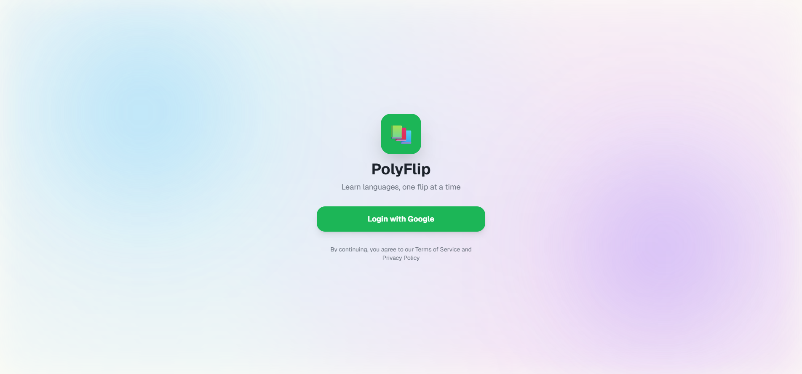
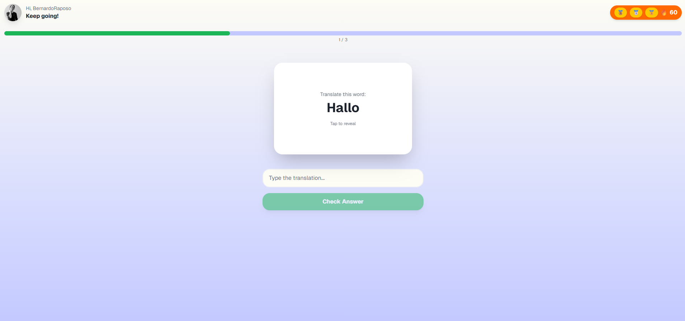
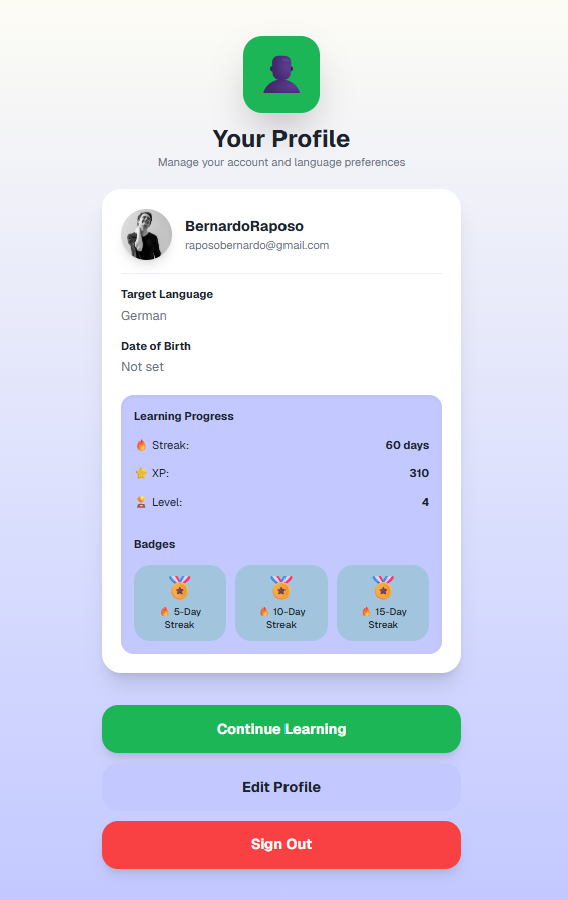

# PolyFlip

A modern, minimal flashcard web app for learning vocabulary fast.  
PolyFlip offers a clean, Duolingo-style experience focused on efficiency, repetition, and smooth UX.

## 🚀 Features
- 🎴 Flip vocabulary cards  
- 🔁 Smart repetition flow  
- 🔍 Clean, simple interface  
- ⚡ Zero-distraction learning

## 🧠 Why I Built This
I have moved to Switzerland and I need to learn German ASAP. Also, I love fast learning tools — but most apps feel bloated.
PolyFlip is my take on a lightweight vocabulary trainer that makes learning feel effortless. It still as a long way to go - this is simply a weekend MVP.

## 🛠 Tech Stack
- Next.js  
- Tailwind CSS
- MongoDB
- Vercel
- Shadcn UI Components

## 📸 Screenshots

## 🧪 Future Improvements
- Make it responsive (doing this very soon!!!)
- Add spaced-repetition algorithm  
- Add difficulty levels  
- Add audio pronunciations
- Icrease word collection
- Increase language collection

## 🔗 Live Demo
https://poly-flip.vercel.app/
